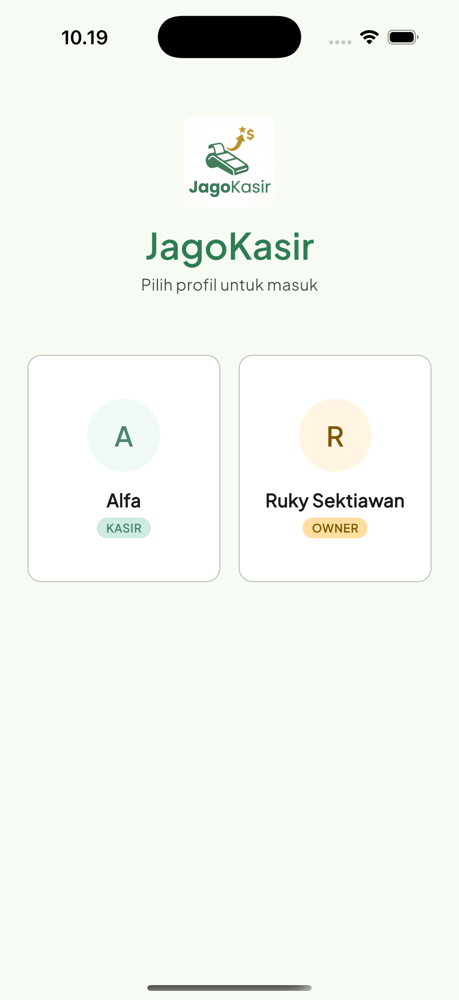
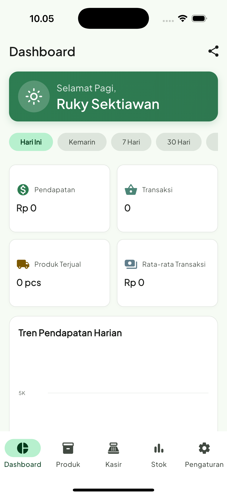
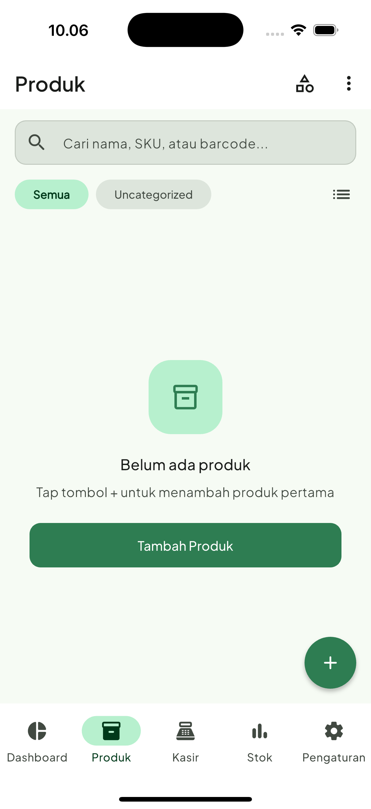
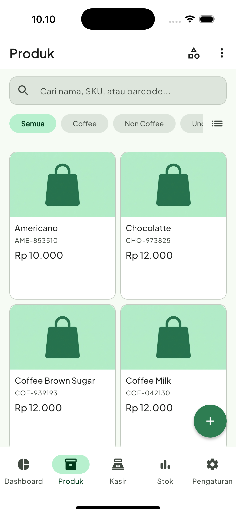
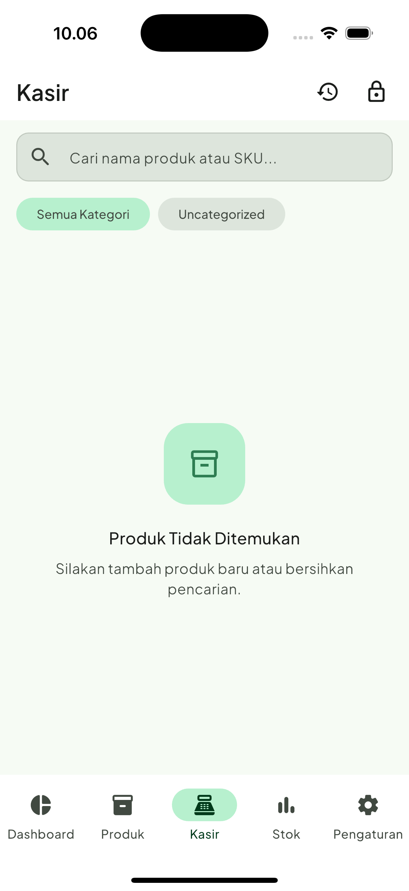
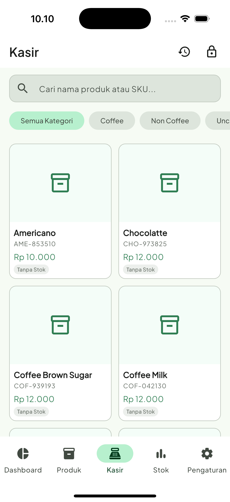
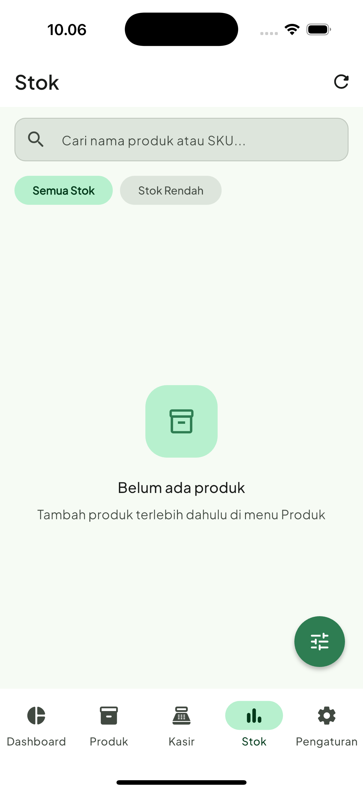
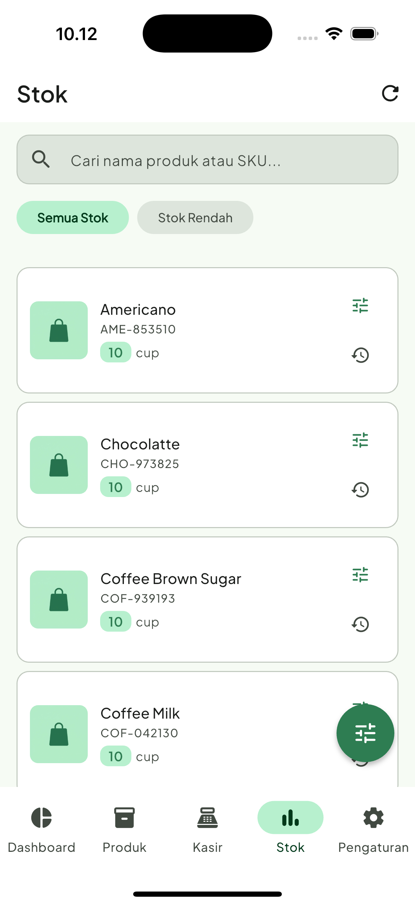
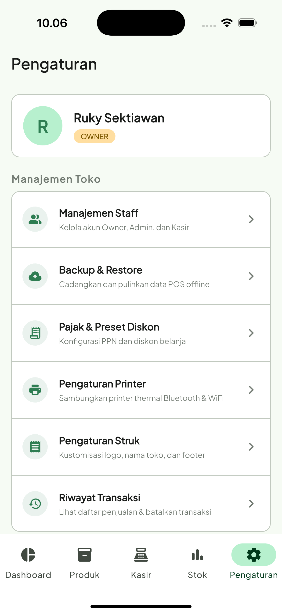

# 🏪 JagoKasir: Smart Offline POS & Cashier System

   

**JagoKasir** is a premium local-first, offline-first Point of Sale (POS) and Cashier application built from the ground up using **Flutter** and **Riverpod**. Designed specifically for Micro, Small, and Medium Enterprises (MSMEs / UMKM) in Indonesia, JagoKasir offers a complete suite of cashier tools without any subscription fees or internet requirements. Keep your business running 100% offline, print receipts via Bluetooth thermal printers, manage stock, analyze profits, and automate secure database backups.

---

## 📸 Screenshots

<p align="center">
  
  
  
  
  
</p>
<p align="center">
  
  
  
  
</p>

---

## 🌐 Landing Page

Visit the official JagoKasir landing page for a detailed visual overview and feature highlights:
**[Live Demo: JagoKasir Premium Landing Page](https://rukys.github.io/jagokasir/)**

---

## ✨ Key Features

- **🏪 Offline-First Cashier (POS) System**: Fast checkout flow, customizable cart, instant calculation of active taxes, and custom discounts. Works entirely offline with zero server loading times or internet dependency.
- **🔒 Secure PIN & Multi-Staff Management**: Protect sensitive business data. Separate access levels for Owner, Admin, and Cashier (Kasir). Critical actions like voiding transactions and exporting reports require Admin/Owner authorization.
- **📦 Smart Inventory & Stock Ledger**: Track every single inventory movement. Adjust stock manually (Stock In / Stock Out), get alerted for low-stock products, and view complete audit trails.
- **🖨️ Thermal Receipt Printing**: Connect seamlessly with Bluetooth (Bluetooth Serial) and WiFi thermal printers. Customize your printed receipt headers, footers, store info, and print store logos.
- **📊 Interactive Sales & Profit Reports**: Detailed dashboards showing total revenue, profit margins, average basket size, daily sales trends (via gorgeous interactive `fl_chart` charts), best-selling products, and category performance.
- **📂 Bulk Import & Export**:
  - **CSV**: Import bulk products to kickstart inventory or export product catalogs.
  - **PDF/CSV**: Export daily/monthly sales summaries, transaction details, and profit sheets.
- **💾 Automated Database Backups**: Securely back up your SQLite database to internal or external storage (automatic or manual scheduling). System automatically checks available device disk space before creating backups.
- **🎨 Premium Material Design 3**: Modern, smooth, and highly responsive user interface optimized for mobile layout, featuring Google Fonts (`Outfit`/`Inter`), shimmer animations, and robust input validations.

---

## 🛠️ Technology Stack

- **SDK & Framework**: [Flutter SDK](https://flutter.dev) (v3.19.0+)
- **State Management**: [Riverpod 2.x](https://riverpod.dev) (with code generation)
- **Local Database**: [Sqflite](https://pub.dev/packages/sqflite) (SQLite for Flutter)
- **Routing**: [GoRouter](https://pub.dev/packages/go_router)
- **Dependency Injection**: [GetIt](https://pub.dev/packages/get_it)
- **Receipt Printing**: [Blue Thermal Printer](https://pub.dev/packages/blue_thermal_printer) & [Esc Pos Utils Plus](https://pub.dev/packages/esc_pos_utils_plus)
- **Visual Charts**: [FL Chart](https://pub.dev/packages/fl_chart)
- **Barcode & QR Scanner**: [Mobile Scanner](https://pub.dev/packages/mobile_scanner)
- **Secure Storage**: [Flutter Secure Storage](https://pub.dev/packages/flutter_secure_storage) & [Shared Preferences](https://pub.dev/packages/shared_preferences)

---

## 🚀 Getting Started

### Prerequisites

Make sure you have set up your Flutter development environment.
- Flutter SDK (`>=3.19.0`)
- Android Studio / VS Code / Xcode (for iOS)
- A physical mobile device or emulator

### Installation

1. **Clone the repository**:
   ```bash
   git clone https://github.com/rukys/jagokasir.git
   cd jagokasir
   ```
2. **Install dependencies**:
   ```bash
   flutter pub get
   ```
3. **Generate Riverpod Providers & Code Generation files**:
   ```bash
   flutter pub run build_runner build --delete-conflicting-outputs
   ```

### Running the Application

**For Android:**
```bash
flutter run -d android
```

**For iOS:**
```bash
flutter run -d ios
```

---

## 📝 Roadmap (V2.0 Ideas)

- ☁️ **Cloud Sync & Multi-Device**: Synchronize store database securely to a private cloud server to support multi-device real-time synchronization.
- 📱 **Tablet Responsive Layout**: Optimize POS layouts for large screens (tablets & iPads) with dual-pane layout.
- 💳 **E-Wallet Payment Integration**: Dynamic QRIS code generation on receipt/screen for modern cashless payment integration.

---

*Crafted with passion for MSMEs & local businesses.* 🏪💼
